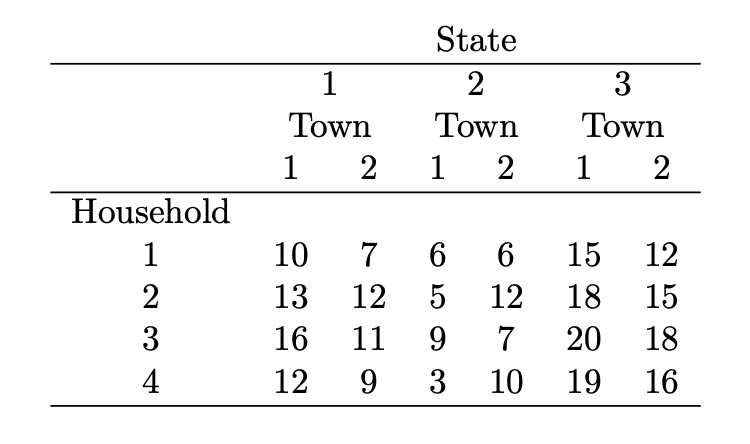
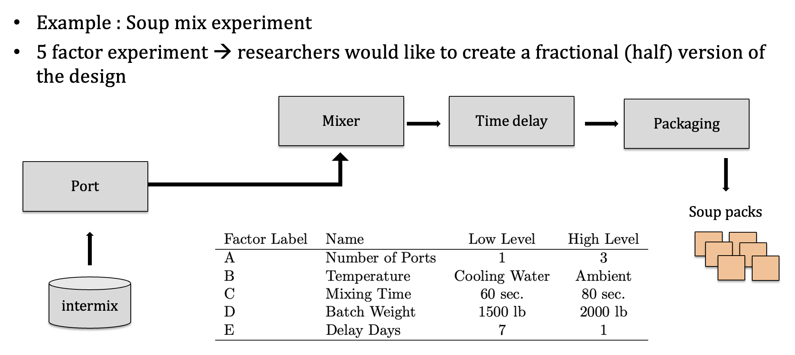

```{r setup, include=FALSE}
knitr::opts_chunk$set(echo = TRUE)
require('daewr')
require('lme4')
require('FrF2')
```

## Objective:

For this lesson we will dive into a few exercises in the topic of variance component analysis and fractional factorial designs

### Problem 1 

Consider the data (Anderson and McLean, 1974) in the following table to come from a sampling study to determine the source of variability in the average amount spent on health care per year in thousands of dollars. Towns are nested within state and households are nested within town.



(a) Use the method of moments and REML methods to determine the variance components for state, town, and household.
(b) What percent of the total variance is due to households? Towns and households?


## Problem 2

Consider the data in Table 5.20 (p.216 in DAE with R book) from Smith and Beverly (1981) taken from a staggered nested design to investigate the sources of variability in impurities in raw materials received at a plant in trailer loads. Two samples of material were taken from each of nine trailer loads of pellets. Two measurements of impurities were made on the first sample from each trailer but only one measurement for the second sample from each trailer.

(a) Write the model for the data.


(b) Analyze the data and estimate the three variance components using the method of moments.

(c) Analyze the data using REML and check to see if your estimates remain the same.


(d) Make half-normal plots of the square root of the variances pooled to get the mean squares for sample(trailer) and measurement(sample). Does the assumption of homogeneous variances appear reasonable?


(e) Calculate the EBLUPs for the random trailer effect and make a normal plot to check the normality assumption. What is your conclusion?

## Problem 3

Reanalyze the data from the golf experiment, presented in the Appendix of Chapter 4 (or dataset `rcb` in the `daewr` R package) using the `lmer` function. Check to see if you get the same P-values and conclusions shown in Section 4.7.


## Problem 4

Consider the soup mix experiment we started reviewing in class



(a) Create a half-fraction design for this experiment 

(b) Retrieve the main effects from the design

(c) Manually check the effects from values computed based on the model object.

(d) Visually inspect the significance of the effects


## Problem 5

Use `FrF2` to create a quarter fraction $2^{5-2}$ design.

(a) Use the `design.info` function to examine the aliases and determine the generators used by `FrF2` to create the design.

(b) Determine the defining relation.

(c) Verify that the alias structure for this design can be obtained from the
defining relation you found in (b).

 
